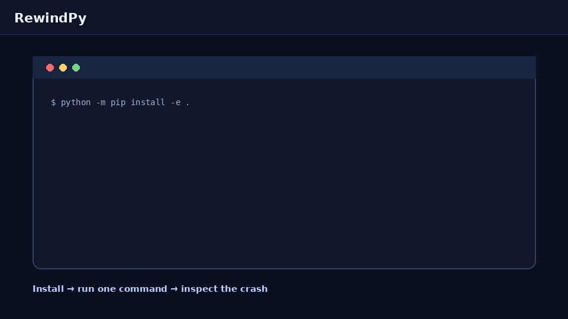

<div align="center">

[English](README.md) | [简体中文](README.zh-CN.md)

# ⏪ RewindPy

### Python 程序崩溃了？把它倒回去。

一个本地运行的 Python 崩溃后时间旅行调试器。

[](https://github.com/LIRuixuan0407/rewindpy/actions/workflows/ci.yml)
[](https://www.python.org/)
[](LICENSE)

</div>



RewindPy 会记录有数量上限、仅限项目代码的执行事件。当出现未捕获异常时，它会生成一个自包含 HTML 报告，让你向前倒带查看源码行、局部变量和每一步的数值变化。

## 一分钟体验

```bash
git clone https://github.com/LIRuixuan0407/rewindpy.git
cd rewindpy
python -m venv .venv
source .venv/bin/activate  # Windows: .venv\Scripts\activate
python -m pip install .
rewindpy --lang zh doctor
rewindpy --lang zh demo --open
```

`rewindpy doctor` 会检查 Python 版本、输出目录权限以及完整的内置报告冒烟测试。内置 Demo 会故意崩溃，生成 `rewindpy-demo.html`，然后以成功状态退出，方便你立即体验报告。

## 调试自己的脚本

```bash
rewindpy --lang zh run --open app.py
```

指定报告路径，并把参数传给目标程序：

```bash
rewindpy --lang zh run --output crash.html app.py -- --port 8080
```

目标程序崩溃时会保留原本的非零退出码，因此 RewindPy 也适合本地脚本和 CI 复现流程。

## v0.1.0 能做什么

- 倒带查看 `call`、`line`、`return` 和 `exception` 事件。
- 查看源码、局部变量和每一步的数值变化。
- 默认打开聚焦故障上下文的 **崩溃切片**，避免淹没在大量无关事件中。
- 追踪缺失字典键在哪一步消失。
- 提示类似 `user_id → userid` 的可能重命名。
- 将 `NoneType` 崩溃追溯到赋值语句或返回 `None` 的函数。
- 从崩溃位置直接跳转到可能的数值来源。
- 报告仅保存在本地，并遮挡常见敏感变量名。
- CLI 和 HTML 报告支持中英文切换。

## 内置演示

```bash
rewindpy --lang zh demo none-origin --open
rewindpy --lang zh demo key-error --open
rewindpy --lang zh demo crash-slice --open
```

## 命令参考

```text
rewindpy --version
rewindpy --lang zh --help
rewindpy [--lang auto|en|zh] doctor [--json]
rewindpy [--lang auto|en|zh] demo [none-origin|key-error|crash-slice] [--output FILE] [--open]
rewindpy [--lang auto|en|zh] run SCRIPT [--output FILE] [--max-events N] [--open] [-- ARGS...]
```

默认情况下，CLI 会根据系统语言自动选择中文或英文。也可以设置 `REWINDPY_LANG=zh`，或者显式添加 `--lang zh`。生成的 HTML 报告右上角可以直接切换 `EN / 中文`。

## 当前范围

RewindPy v0.1.0 面向 Python 3.10+、单线程本地脚本、未捕获异常，以及目标脚本目录下的项目文件。

它不是确定性重放工具。目前不会建模异步任务因果关系、多进程、原生扩展、实时断点或不透明对象内部的任意变化。

## 安全说明

崩溃报告可能包含运行时数据。RewindPy 只在本地写入报告，并遮挡名称中包含 `password`、`token`、`secret`、`api_key` 等关键词的变量或字典键。分享报告前仍然需要人工检查。

## 开发

```bash
python -m pip install -e ".[dev]"
python -m ruff check .
python -m pytest -q
rewindpy doctor
python -m build
python -m twine check dist/*
```

贡献说明请查看 [CONTRIBUTING.md](CONTRIBUTING.md)，安全问题请查看 [SECURITY.md](SECURITY.md)，发布流程请查看 [RELEASING.md](RELEASING.md)，版本历史请查看 [CHANGELOG.md](CHANGELOG.md)。

## 许可证

MIT

## 安全追踪

```bash
rewindpy run --max-events 5000 --include src --exclude tests app.py
```

RewindPy 使用有界环形缓冲区保留最新事件，确保崩溃前的执行尾部不会丢失；默认跳过常见虚拟环境与构建目录，并在报告中展示保留与丢弃事件统计。`--include` 和 `--exclude` 均可重复使用。

### Safe Tracing：报告体积保护

```bash
rewindpy run --max-events 5000 --max-report-mb 10 app.py
```

RewindPy 会压缩重复循环，并在报告超过预算时优先保留崩溃切片、异常事件和数值来源。

## pytest 集成

在测试环境中安装 RewindPy 后，可以为每个失败测试生成本地回放报告：

```bash
pytest --rewind
pytest --rewind --rewind-dir reports --rewind-lang zh
```

成功测试不会生成报告。失败报告默认写入 `.rewindpy/`，pytest 原有的错误输出和退出码保持不变。
